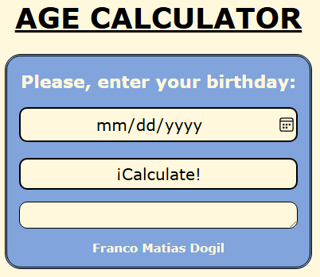

# 🧮 Age Calculator

Una simple pero elegante **calculadora de edad** desarrollada con **HTML**, **CSS** y **JavaScript**. Ingresás tu fecha de nacimiento y la app te muestra cuántos años, meses y días tenés.

## 🚀 Características

- Diseño responsive y moderno
- Validación de datos del usuario
- Cálculo preciso de edad en años, meses y días
- Interfaz intuitiva y accesible

## 🛠 Tecnologías utilizadas

- **HTML5** – estructura del contenido
- **CSS3** – estilos y diseño visual
- **JavaScript** – lógica del cálculo y validaciones

## 📸 Captura de pantalla


## 🔧 Cómo usarla

Podés probar la app directamente en tu navegador:

👉 [Ver calculadora en línea](https://franndogil.github.io/Age-calculator/)

O si preferís ejecutarla localmente:

1. Cloná el repositorio:

   ```bash
   git clone https://github.com/franndogil/Age-calculator.git
